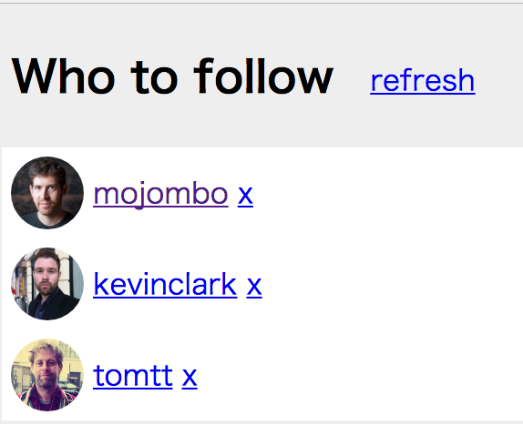

# The introduction to Functional Reactive Programming you've been missing

---

So you're curious in learning this new thing called Functional Reactive Programming (FRP), particularly its variant comprising of Sodium, Reflex, Reactive Banana, Flapjax and others.

The hardest part of a learning journey is **thinking in FRP**.  It's a lot about letting go of old imperative and stateful habits of typical programming, forcing your brain to work in a different paradigm.  I hope this helps you.

## "What is Functional Reactive Programming?"

#### Functional Reactive Programming is programming with events and behaviors.

But that only begs the question.

#### "What are events?"

In a way, this isn't anything new.  Event buses or your typical click events are really events, on which you can observe and do some side effects.  FRP is that idea on steroids.  You are able to create events of anything, not just from click and hover events.  Events are cheap and ubiquitous, anything can be an event: user inputs, properties, caches, data structures, etc.  For example imagine your Twitter feed would be an event in the same fashion that click events are.  You can listen to that event and react accordingly.

**On top of that, you are given an amazing toolbox of functions to combine, create and filter any of those events.**  That's where the "functional" magic kicks in.  An event can be used as an input to another one.  Even multiple events can be used as an input to another one.  You can __mappend__ two events to merge them.  You can __filter__ an event to get another one that has only those events you are interested in.  You can __fmap__ data values from one event to another new one.

If events are so central to FRP, let's take a careful look at them, starting with our familiar "clicks on a button" event.

An event is a list of **ongoing occurrences ordered in time**.  It can emit only one thing: a value.

We capture these emitted occurrences only **asynchronously**, by defining a side-effecting operation that will execute when a value is emitted.  The "listening" to the event is called subscribing.  The operations we are defining are observers.  The event is the subject being observed.  This is precisely the [Observer Design Pattern](https://en.wikipedia.org/wiki/Observer_pattern).

```
--a---b-c---d---->

a, b, c, d are emitted values

---> is the timeline
```

Since this feels so familiar already, let's do something new: we are going to create new click events transformed out of the original click event.

Let's make a counter event that indicates how many times a button was clicked.  In common FRP libraries, each event has many functions attached to it, such as `<$>`, `filter`, `reduce`, etc.  When you call one of these functions, such as `(<$> f click-event)`, it returns a **new event** based on the click event.  It does not modify the original click event in any way.  This is a property called **immutability**, and it goes together with FRP events just like pancakes are good with syrup.  This allows us to chain functions like `(reduce g (<$> f click-event))`, or with a threading macro,

<!-- TODO define <$> -->

```clojure
(->> click-event
  (<$> f)
  (reduce g))
```

<!-- TODO add a graph -->

```
  click-event: ---c----c--c----c------c-->
               vvvv <$> (c becomes 1) vvvv
               ---1----1--1----1------1-->
               vvvvvvvvv reduce + vvvvvvvv
counter-event: ---1----2--3----4------5-->
```

The `<$> f` replaces (into the new event) each emitted vlue according to a function `f` you provide.  In our case, we fmapped to the number 1 on each click.  The `reduce g` aggregates all previous values on the event, producing value `(g accumulated current)`, where `g` was simply the add function in this example.  Then, `counter-event` emits the total number of clicks whenever a click happens.

I hope you enjoy the beauty of this approach.  This example is just the tip of the iceberg: you can apply the same operations on different kinds of events, for instance, on an event of API responses; on the other hand, there are many other functions available.

#### "What are behaviors?"
This isn't anything new, either.  Behaviors are states, roughly speaking.  A global app state or current time are really behaviors, on which you can observe and do some side effects.  FRP is that idea on steroids.  You are able to create behaviors of anything not just from current time and mouse positions.  Behaviors are cheap and ubiquitous, anything can be a observer: user inputs, properties, caches, data structures, etc.  For example imagine your Facebook relationship status would be a behavior in the same fashion that mouse positions are.  You can listen to that behavior and react accordingly.

If behaviors are so central to FRP, let's take a careful look at them.

We capture these return values only **asynchronously** by defining a side-effecting operation that will execute when the behavior is sampled.  The "listening" to the behavior is called subscribing.  The operations we are defining are observers.  The behavior is the subject being observed.  This is precisely the [Observer Design Pattern](https://en.wikipedia.org/wiki/Observer_pattern).

aaabbbbccccddddd>

a, b, c, d are return values

> is the time line

An alternative way to represent behavior is a graph.  The horizontal axis is time.  Behavior takes time and returns some value.  Notice that behavior is defined on every point in time because it is a function.


Compare this with an event.  If we were to represent an event on a graph like this, it would be a bunch of points.  At any given point in time, an event may or may not have a value.


Let's make sure that this difference sinks in.  Take a click event for example.  Each individual click occurs instantly.  But other than those exact moments on which clicks happen, there's no click occurrence.

In contrast, a mouse position can be modeled with a behavior.  At any given point in time, a mouse cursor exists somewhere in a screen.  So a mouse position is defined at any time.

But do we really need behaviors?  We already have events.  Aren't they sufficient?  Actually, yes.  We can do pretty much everything behaviors can do with events for most practical purposes.  In fact, popular non-FRP libraries don't have behaviors.

So, what's the point of a behavior?  One answer is that a behavior gives us more explicit abstraction.  Let me illustrate this point with an example.

We have two counter events.  We want to combine those two to get their product.  If those two events have occurrences at the same point in time, it's easy to combine them.  We can just take a product of those two occurrences.  But what if there's an occurrence for one event but not for the other?

```
counter-1-event : -----1-----2--3------------->
counter-2-event : -------1------2-------3----->
product-event   : -----?-?---?--6-------?----->
```

The problem is that an event may or may not have a value at a point in time. This is where a behavior comes in handy.  Because behaviors are defined on every point in time, it's straightforward to combine them.

In our example, we first want to convert the event into behaviors using `stepper`.  `(stepper default-value event)` returns a behavior, which is a function of time.  This function either returns the last value of event occurrences or the default value if there's no event occurrence yet.

```
counter-1-event        : -----1-----2--3------------->
                         v(stepper 0 counter-1-event)v
(counter-1-behavior t) : 0000001111112223333333333333>

counter-2-event        : -------1------2-------3----->
                         v(stepper 0 counter-1-event)v
(counter-2-behavior t) : 0000000011111112222222233333>
```

Now we are ready to compose two behaviors.  * function works on numbers, but not on behaviors.  In order to make * work on behaviors, we lift *.  That's what (lift-a *) does.

```
(counter-1-behavior t) : 0000001111112223333333333333>
(counter-2-behavior t) : 0000000011111112222222233333>
                         vvvv((lift-a *)          vvvv
                         vvvv  counter-1-behavior vvvv
                         vvvv  counter-2-behavior)vvvv
(product-behavior t)   : 0000000011112226666666699999>
```

Non-FRP libraries can do similar things without explicitly using behaviors.  FRP decomplects the complected and makes behaviors explicit.

## "Why should I consider adopting FRP?"

FRP raises the level of abstraction of your code so you can focus on the interdependences of event occurrences that define the business logic, rather than having to constantly fiddle with a large amount of implementation details.  Code in FRP will likely be more concise.

The benefit is more evident in modern webapps and mobile apps that are highly interactive with a multitude of UI event occurrences related to data event occurrences.  10 years ago, interaction with web pages was basically about submitting a long form to the backend and performing simple rendering to the frontend.  Apps have evolved to be more real-time: modifying a single form field can automatically trigger a save to the backend, "likes" to some content can be reflected in real time to other connected users, and so forth.

Apps nowadays have an abundancy of real-time events of every kind that enable a highly interactive experience to the user.  We need tools for properly dealing with that and FRP is an answer.

## Implementing a "Who to follow" suggestion box

In Twitter there is this UI element that suggests other accounts you could follow:


* On startup, load accounts data from the API and display 3 suggestions
* On clicking "Refresh", load 3 other account suggestions into the 3 rows
* On click 'x' button on an account row, clear only that current account and display another
* Each row displays the account's avatar and links to their page

We can leave out the other features and buttons because they are minor.  And instead of Twitter which recently closed its API to the unauthorized public, let's build that UI for following people on GitHub.  There's a [GitHub API for getting users](https://developer.github.com/v3/users/#get-all-users).

The demo for this is listed as "intro" at https://nodpexamples.github.io in case you want to take a peak already.



TODO: write [great documentation](http://jacobian.org/writing/what-to-write/)

---

### Legal
Based on a work at https://gist.github.com/staltz/868e7e9bc2a7b8c1f754 by Andre Medeiros at http://andre.staltz.com
